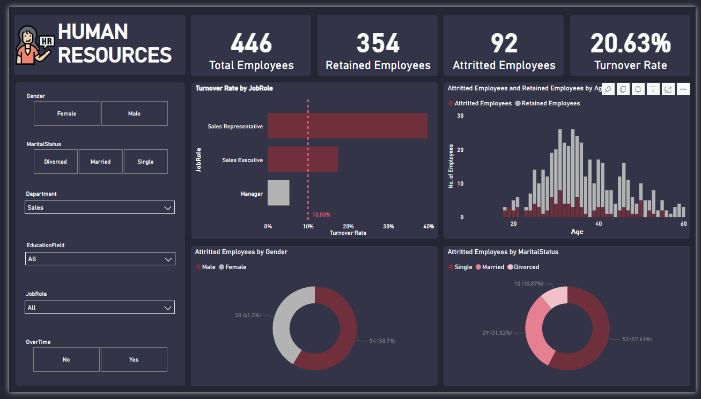

# 👥 HR Analytics Dashboard

An interactive Power BI dashboard designed to analyze employee attrition patterns and workforce dynamics at XDA, a mid-sized tech company undergoing strategic expansion. The report helps HR leaders gain a clear understanding of workforce trends and uncover actionable insights to improve employee retention, satisfaction, and organizational health.

## 📈 Dashboard Preview

🔗 [View the live dashboard](https://app.powerbi.com/view?r=eyJrIjoiM2M1Mzk5MzEtMDhhZi00NDdkLTk0NmMtNjQ3MWY2ZDQyMDU3IiwidCI6IjM3MGZiM2I4LTMzMDYtNDg5MC05MDYzLWNjMDhiZTc4ODI1NyIsImMiOjEwfQ%3D%3D)

## 📊 Key Features

- Overview of total, retained, and attritted employees
- Turnover rate by job role, gender, and marital status
- Age distribution of retained vs. attritted employees
- Breakdown of attrition by department, gender, and job role
- Interactive filtering across multiple HR dimensions

## 🧹 Data Preparation

The report was built using a structured employee dataset, containing 22 variables across demographics, job history, compensation, training, performance, and satisfaction. Key preparation steps included:

- Normalizing demographic and job-related fields
- Engineering new metrics such as turnover rate and overtime impact
- Filtering and categorizing attributes to support drill-through analysis
- Optimizing data model for performance and flexibility

## 📁 Tools & Technologies

- **Power BI**: Advanced DAX, custom visuals, interactive layout
- **Power Query**: Data cleaning and shaping
- Employee dataset (simulated HR database)
- Dark-mode UI for professional readability

## 🧠 Data Insights

The dashboard enables users to:

- Identify high-turnover roles and demographics
- Observe attrition concentration by age and job levels
- Explore correlations (e.g., overtime ↔ attrition, satisfaction ↔ performance)
- Pinpoint at-risk employee groups for early intervention
- Provide HR teams with a data-driven foundation for policy updates

## 📂 Files Included

- `HR_Analytics_Dashboard.pbix` – Power BI project file
- `preview.png` – Dashboard preview image