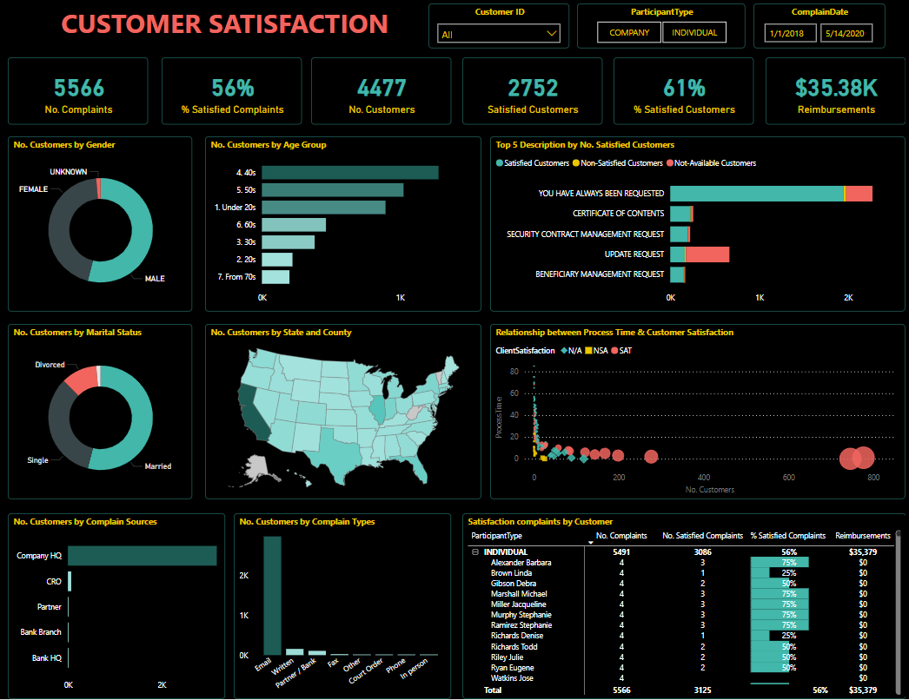

# 🛡️ Insurance Customer Satisfaction Dashboard

An interactive Power BI dashboard that explores customer satisfaction metrics and complaint data from an insurance company. This report is part of an ongoing analytical exploration, aiming to provide actionable insights across key business dimensions such as customer behavior, service quality, and resolution timelines.

## 📈 Dashboard Preview

🔗 [View the live dashboard](https://app.powerbi.com/view?r=eyJrIjoiOGQ3ZGNhMTAtYWJkOS00YTE4LTkzYjktNTQ5MTkwMGVlZTMwIiwidCI6IjM3MGZiM2I4LTMzMDYtNDg5MC05MDYzLWNjMDhiZTc4ODI1NyIsImMiOjEwfQ%3D%3D)

## 📊 Key Features

- Overview of customer complaints by category and severity
- Satisfaction level distribution across regions and time
- Turnaround time and resolution effectiveness
- Interactive slicers for business unit, priority level, and date
- Dark mode theme for modern visual appeal

## 🧹 Data Preparation

The dataset presented several modeling challenges, particularly due to ambiguous relationships between tables. Key data wrangling efforts included:

- Cleaning and standardizing complaint records
- Resolving many-to-many relationships and bridge table logic
- Deriving KPIs from textual complaint logs and time fields
- Establishing dynamic calendar mappings for trend analysis

## 📁 Tools & Technologies

- **Power BI**: Data modeling, DAX, and layered report design
- **Power Query**: ETL and data cleansing
- Custom relationship diagram restructuring
- Applied Enterprise DNA visualization best practices

## 🧠 Personal Note

> I have to admit that [@forum.EnterpriseDNA](https://forum.enterprisedna.co) has posted some truly fascinating Power BI challenges.  
>  
> My friends and I recently stumbled upon this interesting insurance complaint dataset. While the raw data looked promising, it turned out to have several modeling pitfalls that required diving deep into the business logic.  
>  
> This dashboard is still a work in progress—I’m building a larger report with 3–4 analytical dimensions—but here’s the first “sheet” I’d like to share publicly. 😄  

## 📂 Files Included

- `Insurance_Customer_Satisfaction.pbix` – Power BI project file
- `preview.png` – Dashboard preview image