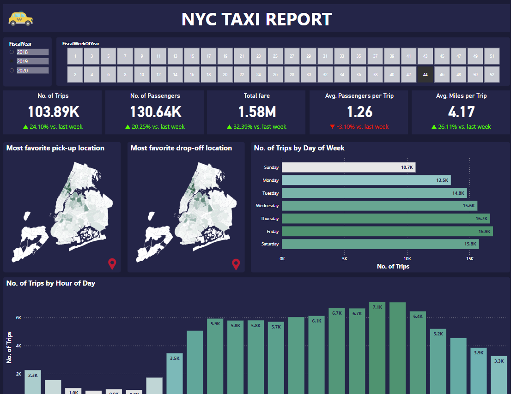

# 🚖 NYC Taxi Dashboard

An interactive Power BI dashboard that visualizes and analyzes taxi trip data in New York City from 2017 to 2020. The report focuses on operational insights to support decision-making, highlighting trip volume, passenger behavior, fare metrics, and peak hours/locations.

## 📈 Dashboard Preview

🔗 [View the live dashboard](https://app.powerbi.com/view?r=eyJrIjoiM2IxN2NmYjctZmFiMS00Zjk4LTk1N2MtMjRlYWQ0ODNjMmVhIiwidCI6IjM3MGZiM2I4LTMzMDYtNDg5MC05MDYzLWNjMDhiZTc4ODI1NyIsImMiOjEwfQ%3D%3D)

## 📊 Key Features

- Weekly total trips and passengers
- Average passengers per ride
- Total and average fare amounts
- Trip distance analysis
- Busiest days and time blocks
- Most frequent pickup & dropoff zones
- Clean, intuitive layout for business users

## 🧹 Data Preparation

All data transformations and cleaning were performed in **Power Query** within Power BI. The logic includes:
- Filtering valid time ranges and locations
- Handling missing or inconsistent passenger and fare data
- Adjusting incorrect timestamps and recalculating key metrics
- Converting negative values to appropriate positives

## 📁 Tools & Technologies

- **Power BI** (data modeling, DAX, visual analytics)
- **Power Query** (ETL, data cleaning)
- Custom calendar and zone mapping tables
- Visual best practices for business reporting

## 🧠 Bonus Insights

Additional charts explore:
- Hourly heatmaps of trip demand
- Trends in distance vs. fare correlations
- Common anomalies in the dataset

## 📂 Files Included

- `NYC_Taxi_Dashboard.pbix` – Power BI project file
- `preview.png` – Dashboard screenshot