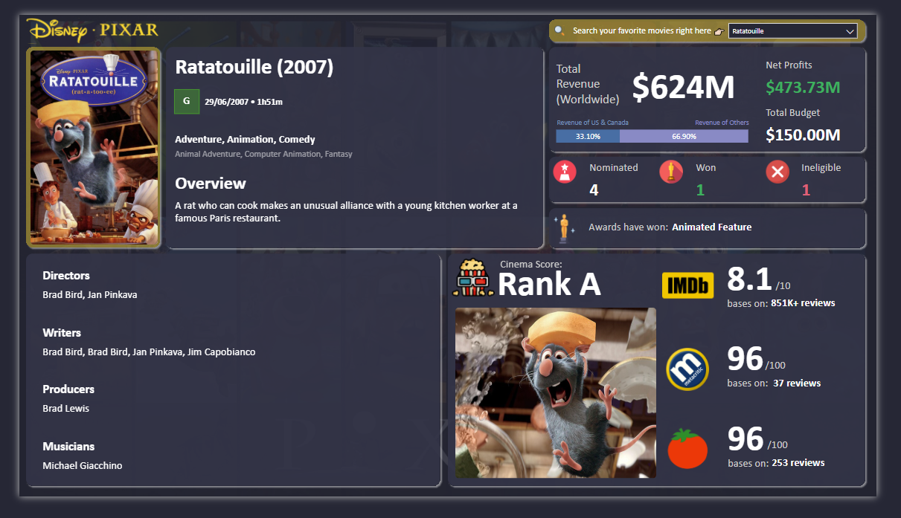

# 🎥 Pixar Legacy Analytics Dashboard

An interactive Power BI dashboard exploring the legacy of Pixar Animation Studios from 1986 to 2023. This project visualizes Pixar’s cinematic success across financial performance, creative teams, audience reception, and award achievements—bringing storytelling to life through data.

## 📈 Dashboard Preview

🔗 [View the live dashboard](https://app.powerbi.com/view?r=eyJrIjoiNjNkMDhkN2MtYzA4MS00Yjk4LTkyMDctNjg1Nzc1NzJiMmFkIiwidCI6IjM3MGZiM2I4LTMzMDYtNDg5MC05MDYzLWNjMDhiZTc4ODI1NyIsImMiOjEwfQ%3D%3D)

## 📊 Key Features

- ROI and net profit breakdown for every Pixar film (1986–2023)
- Revenue distribution by domestic and international markets
- IMDb, Metacritic, and Rotten Tomatoes critic scores
- Oscar nominations, wins, and genre distribution
- Interactive filters by title, director, genre, and release year
- Creative team insights: directors, writers, producers, musicians

## 🧹 Data Preparation

The dashboard uses structured data from a simulated **Pixar Films Database**, including:

- Film details: title, release date, genre, rating
- Financials: budget, box office revenue (US/Canada & international)
- Awards: nominations, wins, Oscar categories
- Reviews: IMDb, Metacritic, Rotten Tomatoes scores
- Creators: directors, writers, producers, composers

Calculated fields include:

- **ROI** = (Box Office / Budget) × 100  
- **Net Profit** = Box Office – Budget  
- Review Score Averages across platforms

## 🧠 The preview image is my most favorite movie: Ratatouille (2007)

> “A rat who can cook makes an unusual alliance with a young kitchen worker at a famous Paris restaurant.”

- 🎬 Directed by: Brad Bird, Jan Pinkava  
- 💰 Budget: $150M | Revenue: $624M | Net Profit: $473.7M  
- 🏆 Awards: 1 Oscar win (Best Animated Feature), 4 nominations  
- ⭐ IMDb: 8.1/10 (851K+ reviews)  
- 🍅 Rotten Tomatoes: 96/100  
- 🎵 Music by: Michael Giacchino  
- 🎥 Cinema Score: **Rank A**

## 📁 Tools & Technologies

- **Power BI** – Data modeling, DAX, dashboard interactivity  
- **Power Query** – Data cleaning and transformations  
- **Figma** – UI layout design and visual mockup  
- **SVG/HTML** – Iconography and UI enhancements

## 📂 Files Included

- `Pixar_Legacy_Analytics.pbix` – Power BI project file  
- `preview.png` – Ratatouille dashboard snapshot

---

✨ *From storytelling to data storytelling—celebrating Pixar’s magic through analytics.* ✨
