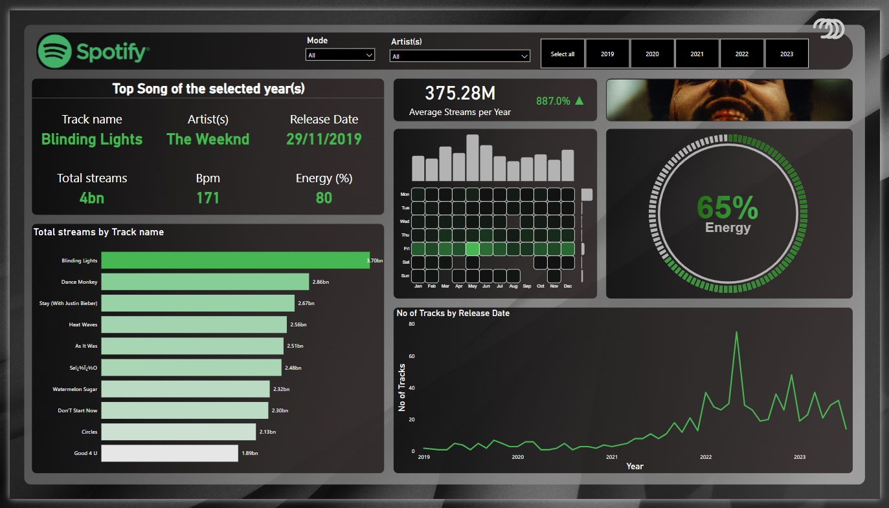

# 🎵 Spotify 2023 Music Analytics Dashboard

An interactive Power BI dashboard analyzing top-performing tracks and musical trends on Spotify in 2023. This project reveals how different musical features—like energy, BPM, and playlist reach—influence streaming performance, offering insights for artists, producers, and labels to fine-tune their release strategy.

## 📈 Dashboard Preview

🔗 [View the live dashboard](https://app.powerbi.com/view?r=eyJrIjoiNDFhN2UyZDktMDhiMy00M2EyLTk0YjktY2UyMTEwOGE2NTViIiwidCI6IjM3MGZiM2I4LTMzMDYtNDg5MC05MDYzLWNjMDhiZTc4ODI1NyIsImMiOjEwfQ%3D%3D)

## 📊 Key Features

- 🎶 Top streamed songs on Spotify in 2023
- 📈 Correlation analysis between BPM, energy, and streams
- 🎧 Playlist impact: does being featured drive more plays?
- 📅 Monthly trends of music releases and streaming volume
- 🔍 Interactive exploration by artist, genre, release month, and more

## 🧹 Data Preparation

This dashboard was built using the **Spotify Music Dataset (2023)**, which includes:

- Track metadata: name, artist(s), release date
- Streaming data: total streams, Spotify chart rankings
- Musical attributes: BPM, key, mode, danceability, energy
- Playlist metrics: number of playlists the song appears in

All data was cleaned and transformed in **Power Query** with derived metrics for comparative analysis and filtering across multiple dimensions.

## 📁 Tools & Technologies

- **Power BI** – Visual analytics, interactive filters, dynamic charts  
- **Power Query** – Data shaping, type conversion, data normalization  
- Audio features modeled after Spotify’s audio analysis API  
- Dark theme optimized for visual clarity and music mood

## 🧠 Insights Unlocked

- 🔥 **Top Hit of 2023**: Identify the most streamed song globally  
- 💃 **Danceability & Streams**: Discover how groove impacts popularity  
- 🕐 **Release Timing**: Pinpoint the best months to drop a new single  
- 🎯 **Playlist Power**: Visualize the impact of playlist inclusion on success  
- 🎼 **Music DNA**: Explore how audio features vary across hits

## 📂 Files Included

- `Spotify_Music_Analytics_2023.pbix` – Power BI project file  
- `preview.png` – Dashboard snapshot for reference

---
✨ *From beats to data points—Spotify stats turned into strategic storytelling.* ✨
